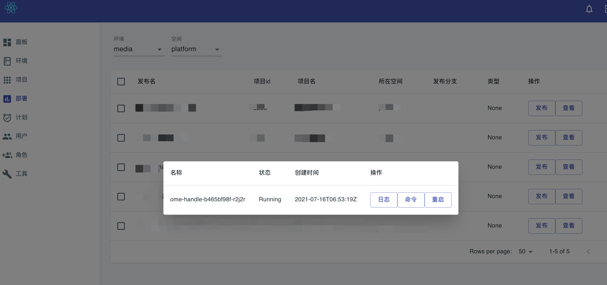

# 部署工具

Clap是一个基于K8S的快速应用部署工具

* 打包：编译项目和依赖，推送到镜像仓库
* 发布：基于打包好的镜像制作Deployment或StatefulSet并apply

当前支持以下几种语言的直接打包和发布
* java -- 需要jib插件
* nginx -- 可以通过npm run build打包
* python -- 需要requirement文件

## 特性

* [x] 多环境，多空间隔离
* [x] 可以一键打包，并查看打包日志，通过Job进行互相隔离和并行打包
* [x] 可以使用用户认证单个部署管理多个集群，也可以使用sa每个集群单独部署
* [x] 基于xterm的pod日志查看和执行命令
* [x] 支持查看plume网关生成的文档
* [ ] 支持多种ingress，目前支持Contour（下个版本添加Istio）
* [x] 登陆和完整的权限管理，权限到按钮
* [x] 依赖K8S的配置中心，优先级：发布>空间>环境>项目
* [ ] 发布计划，发布计划仅可以被创建者和管理员查看
* [ ] 发布日志和回滚
* [ ] 详细的文档和示例
* [ ] 面板做一些统计信息

## 使用

上图是一个为None类型的应用，需要提供[镜像信息](doc/example/none_deploy.json)

如果是一个需要平台打包的Java应用，则需要提供[maven信息](doc/example/java_deploy.json)

当然这些信息都存储在数据库

## 配置

[配置format](doc/example/format_info.json)
